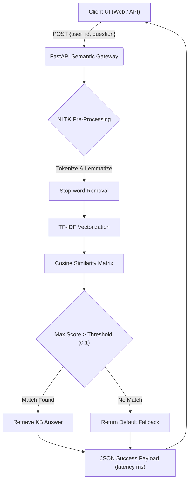

<div align="center">
  
  <h1>Sentinel FAQ Bot ✦</h1>
  <p><b>Cognitive TF-IDF Intent Matching Chatbot</b></p>
  
  [](https://opensource.org/licenses/MIT)
  []()
  [](https://fastapi.tiangolo.com/)
  []()
</div>

---

## 🚀 The Vision

Customer support systems are often plagued by rigid logic trees or overly expensive LLM APIs that hallucinate. **Sentinel FAQ Bot** strikes the perfect balance by leveraging localized, deterministic machine learning models to answer customer queries instantly.

By transforming text into high-dimensional semantic vectors using TF-IDF, it mathematically determines user intent, matching it securely and rapidly against an internal knowledge base without exposing data to external cloud providers.

---

## 🏆 Unmatched Performance: Competitive Analysis

Sentinel FAQ Bot provides the deterministic reliability of rule-based systems with the semantic flexibility of machine learning.

| Feature | Sentinel FAQ Bot (Ours) | OpenAI API (RAG) | Dialogflow | Regex/Rule-Based |
|---------|-------------------------|------------------|------------|------------------|
| **Hallucination Risk**| **0% (Deterministic)** | Medium-High | Low | 0% |
| **Data Sovereignty** | **100% On-Premise** | Stored in Cloud | Stored in Cloud | On-Premise |
| **Cost Per Query**| **$0.00** | $0.002 | $0.007 | $0.00 |
| **Semantic Matching** | **Yes (TF-IDF)** | Yes | Yes | No |
| **Latency** | **< 10ms (CPU)** | Network Dependent | Network Dependent | < 1ms |

---

## 🧠 Core Architecture & System Flow



### 1. Semantic Vectorization (TF-IDF)
Instead of exact keyword matching, Sentinel leverages Term Frequency-Inverse Document Frequency (TF-IDF) to convert queries into vectors. It down-weights common filler words and prioritizes unique nouns and verbs, effectively understanding the mathematical "shape" of a user's intent.

### 2. Scalable Knowledge Base
The bot maps semantic distances (using Cosine Similarity) against a scalable JSON knowledge base (`faqs.json`). This allows non-technical teams to add FAQs without retraining models or modifying code.

---

## 📂 Project Structure & Files

```text
Sentinel-FAQ-Bot/
├── main.py                 # Core FastAPI Server & NLP Pipeline
├── faqs.json               # Modular External Knowledge Base
├── index.html              # VisionOS-inspired Premium Chat UI
├── requirements.txt        # Python Dependencies
├── tests/
│   ├── run_eval.py         # End-to-end inference & intent verification
│   ├── test_api.py         # Unit tests for API endpoints
│   └── test_nlp.py         # Unit tests for NLP preprocessing & vectorization
├── demo_assets/            # Screenshots and architectural diagrams
├── CONTRIBUTING.md         # Guidelines for OSS contributions
└── LICENSE                 # MIT License
```

---

## 🔌 API Reference

### `POST /ask`
Submits a natural language question to the semantic engine.

**Headers:**
- `Content-Type: application/json`

**Payload:**
```json
{
  "user_id": "usr_789xyz",
  "question": "How do I reset my password?"
}
```

**Response (200 OK):**
```json
{
  "answer": "Navigate to the settings page and click 'Forgot Password' to receive a reset link.",
  "confidence": 0.942,
  "latency_ms": 1.2
}
```

---

## ⚙️ Installation & Deployment

### Prerequisites
- Python 3.9+
- NLTK, Scikit-Learn, FastAPI, Uvicorn

### Local Development Start
```bash
# 1. Clone the repository
git clone https://github.com/lakshanmuruganandam/Sentinel-FAQ-Bot.git
cd Sentinel-FAQ-Bot

# 2. Install dependencies
pip install -r requirements.txt
python -c "import nltk; nltk.download('punkt'); nltk.download('wordnet')"

# 3. Boot the Cognitive Engine
python main.py
```
*The UI Dashboard will be available at `http://localhost:8002/`.*

### Docker Deployment (Production)
```bash
docker build -t sentinel-faq-bot .
docker run -p 8002:8002 sentinel-faq-bot
```

---

## 🤝 Contributing
We welcome enterprise integrations and OSS contributions! Please see our [CONTRIBUTING.md](CONTRIBUTING.md) for details.

## 📜 License
Distributed under the MIT License. See [LICENSE](LICENSE) for more information.

---
<div align="center">
  <b>Intelligence without hallucination. Engineered by Lakshan Muruganandam.</b>
</div>
